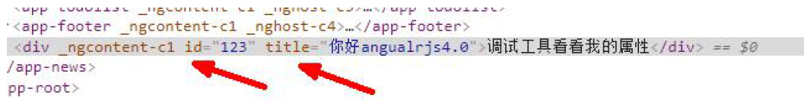
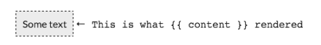
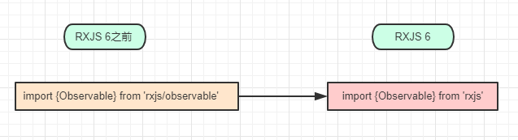
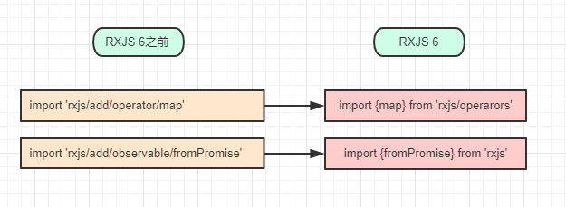
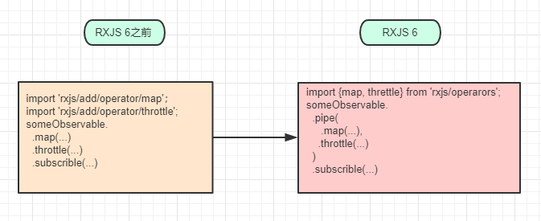
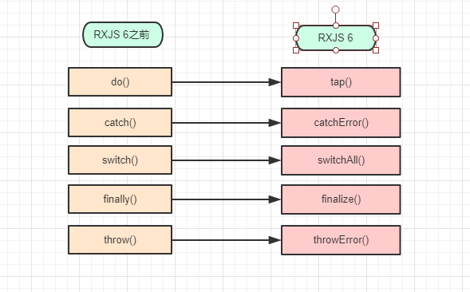

<p align="center">
  <a href="https://ng-alain.com">
    
  </a>
</p>

<h1 align="center">ng-learning</h1>

<div align="center">
  一个基于 Antd 中后台前端解决方案，提供更多通用性业务模块，让开发者更加专注于业务。

</div>

## 快速入门

文档：

https://cn.rx.js.org/

http://bbs.itying.com/topic/5bfce189b110d80f905ae545


### 开发风格用法

#### 单一规则

* 坚持每个文件只定义一样东西（例如服务或组件）。

* 考虑把文件大小限制在 400 行代码以内。

#### 小函数

*  坚持定义简单函数

* 考虑限制在 75 行之内。


## 命名

* 小驼峰形式（`camelCase`）：符号、属性、方法、管道名、非组件指令的选择器、常量。 小驼峰（也叫标准驼峰）形式的第一个字母要使用小写形式。比如 "`selectedHero`"。

* 大驼峰形式（`UpperCamelCase`）或叫帕斯卡形式（`PascalCase`）：类名（包括用来定义组件、接口、`NgModule`、指令、管道等的类）。 大驼峰形式的第一个字母要使用大写形式。比如 "`HeroListComponent`"。

* 中线形式（`dash-case`）或叫烤串形式（`kebab-case`）：文件名中的描述部分，组件的选择器。比如 "`app-hero-list`"。

* 下划线形式（`underscore_case`）或叫蛇形形式（`snake_case`）：在 `Angular` 中没有典型用法。蛇形形式使用下划线连接各个单词。 比如 "`convert_link_mode`"。

* 大写下划线形式（`UPPER_UNDERSCORE_CASE`）或叫大写蛇形形式（`UPPER_SNAKE_CASE`）：传统的常量写法（可以接受，但更推荐用小驼峰形式（`camelCase`） 大蛇形形式使用下划线分隔的全大写单词。比如 "`FIX_ME`"。

### 坚持所有符号使用一致的命名规则。


*  坚持遵循同一个模式来描述符号的特性和类型。推荐的模式为 `feature.type.ts`。

* 目录名和文件名应该清楚的传递它们的意图。 例如，`app/heroes/hero-list.component.ts` 包含了一个用来管理英雄列表的组件。

### 使用点和横杠来分隔文件名

* 坚持使用惯用的后缀来描述类型，包括 `*.service、*.component、*.pipe、.module、.directive`。 必要时可以创建更多类型名，但必须注意，不要创建太多。


|  符号名   | 文件名  |
|  ----  | ----  |
| `HeroDetailComponent`  | `hero-detail.component.ts` |
| `HeroesComponent`      | `heroes.component.ts` |
|`@Pipe({ name: 'initCaps' })`<br/>`export class InitCapsPipe implements PipeTransform { }`|`init-caps.pipe.ts`
|    |  |            

### 组件选择器

*  坚持使用中线命名法（`dashed-case`）或叫烤串命名法（`kebab-case`）来命名组件的元素选择器。

*  坚持使用带连字符的小写元素选择器值（例如 `admin-users`）。

*  坚持为组件选择器添加自定义前缀。 例如，`toh` 前缀表示 `Tour of Heroes`（英雄指南），而前缀 `admin` 表示管理特性区。

*  坚持使用前缀来识别特性区或者应用程序本身。

```ts
@Component({
  selector: 'toh-hero'
})
export class HeroComponent {}
```

#### 指令选择器

*  坚持使用小驼峰形式命名指令的选择器。

*  为何？可以让指令中的属性名与视图中绑定的属性名保持一致。


```ts
@Directive({
  selector: '[tohValidate]'
})
export class ValidateDirective {}
```


### 管道名 (`pipe`)

*  坚持为所有管道使用一致的命名约定，用它们的特性来命名。 管道类名应该使用 `UpperCamelCase`（类名的通用约定），而相应的 `name` 字符串应该使用 `lowerCamelCase`。 `name` 字符串中不应该使用中线（“中线格式”或“烤串格式”）。


|  符号名   | 文件名  |
|  ----  | ----  |
| `@Pipe({ name: 'ellipsis' }))`<br/>`export class EllipsisPipe implements PipeTransform { } ` | `ellipsis.pipe.ts` |
| `@Pipe({ name: 'initCaps' })`<br/>`export class InitCapsPipe    implements PipeTransform { }`|i`nit-caps.pipe.ts`
|    |  |   


### 单元测试文件名

*  坚持测试规格文件名与被测试组件文件名相同。

*  坚持测试规格文件名添加 `.spec` 后缀。

>组件

```ts

heroes.component.spec.ts

hero-list.component.spec.ts

hero-detail.component.spec.ts
```

>服务


```ts
logger.service.spec.ts

hero.service.spec.ts

filter-text.service.spec.ts
```

>管道

```ts

ellipsis.pipe.spec.ts

init-caps.pipe.spec.ts
```

### 总体结构的指导原则


*  坚持把所有源代码都放到名为 `src` 的目录里。

*  坚持如果组件具有多个伴生文件 (`.ts、.html、.css 和 .spec`)，就为它创建一个文件夹。

### 共享特性模块


*  坚持在 `shared` 目录中创建名叫 `SharedModule` 的特性模块（例如在 `app/shared/shared.module.ts` 中定义 `SharedModule`）。

*  坚持在共享模块中声明那些可能被特性模块引用的可复用组件、指令和管道。


### 内联输入和输出属性装饰器

*  坚持 使用 `@Input()` 和 `@Output()`，而非 `@Directive` 和 `@Component` 装饰器的 `inputs` 和 `outputs` 属性:

* 坚持把 `@Input()` 或者 `@Output()` 放到所装饰的属性的同一行。


```ts
@Component({
  selector: 'toh-hero-button',
  template: `<button>{{label}}</button>`
})
export class HeroButtonComponent {
  @Output() heroChange = new EventEmitter<any>();
  @Input() label: string;
}

```

### 成员顺序


* 坚持把属性成员放在前面，方法成员放在后面。

* 坚持先放公共成员，再放私有成员，并按照字母顺序排列。


```ts
export class ToastComponent implements OnInit {
  // public properties
  message: string;
  title: string;

  // private fields
  private defaults = {
    title: '',
    message: 'May the Force be with you'
  };
  private toastElement: any;

  // public methods
  activate(message = this.defaults.message, title = this.defaults.title) {
    this.title = title;
    this.message = message;
    this.show();
  }

  ngOnInit() {
    this.toastElement = document.getElementById('toh-toast');
  }

  // private methods
  private hide() {
    this.toastElement.style.opacity = 0;
    window.setTimeout(() => this.toastElement.style.zIndex = 0, 400);
  }

  private show() {
    console.log(this.message);
    this.toastElement.style.opacity = 1;
    this.toastElement.style.zIndex = 9999;
    window.setTimeout(() => this.hide(), 2500);
  }
}

```

### 把逻辑放到服务里

```ts
import { Component, OnInit } from '@angular/core';

import { Hero, HeroService } from '../shared';

@Component({
  selector: 'toh-hero-list',
  template: `...`
})
export class HeroListComponent implements OnInit {
  heroes: Hero[];
  constructor(private heroService: HeroService) {}
  getHeroes() {
    this.heroes = [];
    this.heroService.getHeroes()
      .subscribe(heroes => this.heroes = heroes);
  }
  ngOnInit() {
    this.getHeroes();
  }
}
```

### 不要给输出属性加前缀

```ts
/* avoid */

@Component({
  selector: 'toh-hero',
  template: `...`
})
export class HeroComponent {
  @Output() onSavedTheDay = new EventEmitter<boolean>();
}

<!-- avoid -->

<toh-hero (onSavedTheDay)="onSavedTheDay($event)"></toh-hero>
```

```ts
<!-- good -->
export class HeroComponent {
  @Output() savedTheDay = new EventEmitter<boolean>();
}

<toh-hero (savedTheDay)="onSavedTheDay($event)"></toh-hero>
```

### 把表现层逻辑放到组件类里

```ts
/* avoid */

@Component({
  selector: 'toh-hero-list',
  template: `
    <section>
      Our list of heroes:
      <hero-profile *ngFor="let hero of heroes" [hero]="hero">
      </hero-profile>
      Total powers: {{totalPowers}}<br>
      Average power: {{totalPowers / heroes.length}}
    </section>
  `
})
export class HeroListComponent {
  heroes: Hero[];
  totalPowers: number;
}

```

```ts

<!-- good -->
@Component({
  selector: 'toh-hero-list',
  template: `
    <section>
      Our list of heroes:
      <toh-hero *ngFor="let hero of heroes" [hero]="hero">
      </toh-hero>
      Total powers: {{totalPowers}}<br>
      Average power: {{avgPower}}
    </section>
  `
})
export class HeroListComponent {
  heroes: Hero[];
  totalPowers: number;

  get avgPower() {
    return this.totalPowers / this.heroes.length;
  }
}

```

### 提供一个服务


* 坚持在服务的 `@Injectable` 装饰器上指定通过应用的根注入器提供服务。坚持当使用类型作为令牌来注入服务的依赖时，使用 `@Injectable()` 类装饰器，而非 `@Inject()` 参数装饰器。

```ts
/* avoid */

export class HeroArena {
  constructor(
      @Inject(HeroService) private heroService: HeroService,
      @Inject(HttpClient) private http: HttpClient) {}
}

```


```ts
/* good */
@Injectable()
export class HeroArena {
  constructor(
    private heroService: HeroService,
    private http: HttpClient) {}
}

```


## 生命周期钩子的作用及调用顺序

* 官方文档：https://www.angular.cn/guide/lifecycle-hooks

* 生命周期函数通俗的讲就是组件创建、组件更新、组件销毁的时候会触发的一系列的方法。

* 当`Angular` 使用构造函数新建一个组件或指令后，就会按下面的顺序在特定时刻调用这些生命周期钩子方法。

| 钩子     | 用途及时机 |
| ------------------------- |------------------------------------------------------------ |
|`constructor()`          | `constructor`，来初始化类。`Angular`中的组件就是基于`class`类实现的，在`Angular`中，`constructor`用于注入依赖。组件的构造函数会在所有的生命周期钩子之前被调用，它主要用于依赖注入或执行简单的数据初始化操作。|
| `ngOnChanges()`           | 当 `Angular`（重新）设置数据绑定输入属性时响应。 该方法接受当前和上一属性值的 `SimpleChanges` 对象在 `ngOnInit()` 之前以及所绑定的一个或多个输入属性的值发生变化时都会调用。 |
| `ngOnInit()`              | 在 `Angular` 第一次显示数据绑定和设置指令/组件的输入属性之后，初始化指令/组件。在第一轮 `ngOnChanges()` 完成之后调用，只调用**一次**。<br>使用 `ngOnInit()` 有两个原因:<br>1.在构造函数之后马上执行复杂的初始化逻辑 <br> 2.在 `Angular` 设置完输入属性之后，对该组件进行准备。有经验的开发者会认同组件的构建应该很便宜和安全|
| `ngDoCheck()`             | 检测，并在发生 `Angular` 无法或不愿意自己检测的变化时作出反应。在每个变更检测周期中，紧跟在 `ngOnChanges()` 和 `ngOnInit()` 后面调用。 |
| `ngAfterContentInit()`    | 当 `Angular` 把外部内容投影进组件/指令的视图之后调用。第一次 `ngDoCheck()` 之后调用，只调用一次。 |
| `ngAfterContentChecked()` | 每当 Angular 完成被投影组件内容的变更检测之后调用。`ngAfterContentInit()` 和每次 `ngDoCheck()` 之后调用 |
| `ngAfterViewInit()`       | 当 `Angular` 初始化完组件视图及其子视图之后调用。第一次 `ngAfterContentChecked()` 之后调用，只调用一次。在这里可以操作DOM |
| `ngAfterViewChecked()`    | 每当 `Angular` 做完组件视图和子视图的变更检测之后调用。`ngAfterViewInit()` 和每次 `ngAfterContentChecked()` 之后调用。 |
| `ngOnDestroy()`           | 当 `Angular` 每次销毁指令/组件之前调用并清扫。在这儿反订阅可观察对象和分离事件处理器，以防内存泄 漏。在 `Angular` 销毁指令/组件之前调用。比如：移除事件监听、清除定时器、退订 `Observable` 等。 |


```ts
export class LifecircleComponent {

    constructor() {

        console.log('00构造函数执行了---除了使用简单的值对局部变量进行初始化之外，什么都不应该做')
    }

    ngOnChanges() {

        console.log('01ngOnChages执行了---当被绑定的输入属性的值发生变化时调用(父子组件传值的时候会触发)'); 
    }

    ngOnInit() {
        console.log('02ngOnInit执行了--- 请求数据一般放在这个里面');
    }
    ngDoCheck() {
        console.log('03ngDoCheck执行了---检测，并在发生 Angular 无法或不愿意自己检测的变化时作出反应');
    }
    ngAfterContentInit() {
        console.log('04ngAfterContentInit执行了---当把内容投影进组件之后调用');
    }
    ngAfterContentChecked() {
        console.log('05ngAfterContentChecked执行了---每次完成被投影组件内容的变更检测之后调用');
    }
    ngAfterViewInit() : void {
        console.log('06 ngAfterViewInit执行了----初始化完组件视图及其子视图之后调用（dom操作放在这个里面）');
    }
    ngAfterViewChecked() {
        console.log('07ngAfterViewChecked执行了----每次做完组件视图和子视图的变更检测之后调用');
    }

    ngOnDestroy() {
        console.log('08ngOnDestroy执行了····');
    }

    //自定义方法
    changeMsg() {

        this.msg = "数据改变了";
    }
}
```

### 绑定数据和内置常用指令

* 星号（`*`）前缀

* 星号是一个用来简化更复杂语法的“语法糖”。 从内部实现来说，`Angular` 把 `*ngIf` 属性 翻译成一个 `<ng-template>` 元素, 并用它来包裹宿主元素

* `Angular` 不允许`*ngFor` 和 `*ngIf` 放在同一个宿主元素上

> 数据文本绑定

`{{}}`

```
<h1>
{{title}}
</h1>
```

>绑定html

```ts
this.h="<h2>这是一个h2 用[innerHTML]来解析</h2>"
```

```html
<div [innerHTML]="h"></div>
```

>绑定属性

```html
<div [id]="id" [title]="msg">调试工具看看我的属性</div>
```




>【`ngIf`】表达式结果为真，显示元素；表达式结果为假，移除元素。

```html
<div *ngIf="a > b"></div> 
```

>【`ngSwitch`】对表达式进行一次求值，然后根据其结果来决定如何显示指令内的嵌套元素。

*　一旦表达式有了结果，就可以

* 使用`ngSwitchCase`指令描述已知结果；

* 使用`ngSwitchDefault`指令处理所有其他未知情况。

* 当你需要根据一个条件来渲染不同元素的时候，如下代码使用了`ngIf`来实现：

```html
<div class="container"> 
　　<div *ngIf="myVar == 'A'">Var is A</div> 
　　<div *ngIf="myVar == 'B'">Var is B</div> 
　　<div *ngIf="myVar == 'C'">Var is C</div> 
　　<div *ngIf="myVar != 'A' && myVar != 'B' && myVar != 'C'">Var is something else</div> 
</div>
```

* 如你所见，`myVar` 的取值越多，最后的条件就变得非常繁琐。

* 如果用 `ngSwitch` 指令重写：

```html
<div class="container" [ngSwitch]="myVar"> 
    <div *ngSwitchCase="'A'">Var is A</div> 
    <div *ngSwitchCase="'B'">Var is B</div> 
    <div *ngSwitchCase="'C'">Var is C</div>
    <div *ngSwitchDefault>Var is something else</div> 
</div>
```
* `ngSwitchDefault`元素是可选的。如果我们不用它，那么当myVar没有匹配到任何期望的值时就不会渲染任何东西。

* 你也可以为不同的元素声明同样的`*ngSwitchCase`值：

* 这样，当`choice`的值为2时，第二个和第五个`<li></li>`都会被渲染。

```html
<div class="ui raised segment"> 
    <ul [ngSwitch]="choice"> 
        <li *ngSwitchCase="1">First choice</li> 
        <li *ngSwitchCase="2">Second choice</li> 
        <li *ngSwitchCase="3">Third choice</li> 
        <li *ngSwitchCase="4">Fourth choice</li> 
        <li *ngSwitchCase="2">Second choice, again</li> 
        <li *ngSwitchDefault>Default choice</li> 
    </ul> 
</div>    
```

> 【`ngStyle`】根据表达式的结果给特定的DOM元素设定CSS属性

* 该指令最简单的用法就是`[style.<cssproperty>]="value"`的形式：

* `ngStyle`指令把`CSS`的`background-color`属性设置为字符串字面量 `yellow`。

```html
<div [style.background-color]="'yellow'"> 
    Uses fixed yellow background 
</div>
```

* 设置固定值的方式就是使用`ngStyle`属性，使用键值对来设置每个属性：
```html

<div 
[ngStyle]="{color: 'white','background-color':'blue'}"> 
    Uses fixed white text on blue background 
</div>
```


>【`ngClass`】动态设置和改变一个给定`DOM`元素的`CSS`类

* 传入一个对象字面量

* 假设我们有一个叫作`bordered`的`CSS`类，用来给元素添加一个黑色虚线边框：

* 使用`ngClass`指令来动态分配`CSS`类：

```css
.bordered { 
    border: 1px dashed black; 
    background-color: #eee; 
} 
```

```html　
<div [ngClass]="{bordered: isBordered}"> 
    Using object literal. Border {{ isBordered ? "ON" : "OFF" }} 
</div>
```

* 或者在组件中定义该对象，并且直接使用它：


```ts
export class NgClassSampleApp { 
    isBordered: boolean; 
    classesObj: Object; 
    classList: string[];
}
```

```html
<div [ngClass]="classesObj"> 
    Using object var. Border 
    {{ classesObj.bordered ? "ON" : "OFF" }} 
</div>
```

* 传入一个数组型字面量

```html
<div class="base" [ngClass]="['blue', 'round']"> 
    This will always have a blue background and round corners 
</div>
```


* 或者在组件中声明一个数组对象，并把它传进来：

```html
this.classList = ['blue', 'round'];

<div class="base" [ngClass]="classList"> 
    This is {{ classList.indexOf('blue') > -1 ? "" : "NOT" }} blue and {{ classList.indexOf('round') > -1 ? "" : "NOT" }} round 
</div> 
```

>【`ngFor`】重复一个给定的`DOM`元素（或一组`DOM`元素），每次重复都会从数组中取一个不同的值

* 它的语法是 `*ngFor="let item of items"`

* `let item`语法指定一个用来接收`items`数组中每个元素的（模板）变量。

* `items`是来自组件控制器的一组项的集合。

* 假设在组件控制器中声明了一个城市的数组：

```html
this.cities = ['Miami', 'Sao Paulo', 'New York'];

<div  *ngFor="let c of cities"> 
    <div>{{ c }}</div> 
</div> 
```

* 获取索引

* 我们可以在`ngFor`指令的值中插入语法`let idx = index`并用分号分隔开，这样就可以获取索引了。

* 例如，对第一个例子进行修改，添加代码段`let num = index`。

```html
<div *ngFor="let c of cities; let num = index"> 
    <div>{{ num+1 }} - {{ c }}</div> 
</div>
```

* `template` 循环数据

```html
<ul>
  <li template="ngFor let item of list">
      {{item}}
  </li>
</ul>
```


> 【`ngNonBindable`】当我们想告诉`Angular`不要编译或者绑定页面中的某个特殊部分时，要使用`ngNodBindable`指令

* 假设我们想要用一个`div`来渲染变量`content`的内容，紧接着输出文本 `this is what {{ content }} rendered`来指向变量实际的值。通常情况下，`{{content}}`会被绑定到`content`变量的值，因为使用了`{{ }}`模板语法，为了能够渲染出纯文本，我们使用`ngNonBindable`指令：

* 有了`ngNonBindable`属性，`Angular`不会编译第二个`span`里的内容，而是原封不动地将其显示出来：

```html
<div> 
    <span>{{ content }}</span> 
    <span ngNonBindable> 
        &larr; This is what {{ content }} rendered 
    </span> 
</div> 
```


>【`NgModle`】 双向绑定到`html`表单元素

* 虽然 `ngModel` 是一个有效的 `Angular` 指令，不过它在默认情况下是不可用的。

* 它属于一个可选模块 `FormsModule`，必须自行添加此模块才能使用该指令。


```html
<div>
  <input type="text" placeholder="name" [(ngModel)]="hero.name"/>
</div>
```

>`(click)=”getData()”`

```html
<button (click)="getData($event)">
         点击按钮触发事件
</button>
<button (click)="setData($event)">
       点击按钮设置数
</button>
```

```ts
/*自定义方法获取数据*/
getData(){ 
//获取
alert(this.msg);
}
setData(){
//设置值
this.msg='这是设置的值';
}
```

#### 表单事件

```
<input type="text" (keyup)="keyUpFn($event)"/>
```

```
keyUpFn(e){
   console.log(e)
}
```


## 管道 (`Pipe`)

```ts
public today=new Date();
```

```html
<p>{{today | date:'yyyy-MM-dd HH:mm:ss' }}</p>
```

大小写转换

```html
<p>{{str | uppercase}}</p>//转换成大写
<p>{{str | lowercase}}</p>//转换成小写
```

日期格式转换

```html
<p>{{today | date:'yyyy-MM-dd HH:mm:ss' }}</p> 
```

小数位数

```html
<p>{{p | number:'1.2-4'}}</p>  JavaScript 对象序列化
```

 `JavaScript` 对象序列化

```html
<p>{{ { name: 'semlinker' } | json }}</p> 
<!-- Output: { "name": "semlinker" } -->
```

`slice`

```html
<p>{{ 'semlinker' | slice:0:3 | uppercase }}</p> 
<!-- Output: SEM -->
```

### 自定义管道


*  `WelcomePipe` 定义

   ```ts
  import { Pipe, PipeTransform } from '@angular/core';

  @Pipe({ name: 'welcome' })
  export class WelcomePipe implements PipeTransform {
    transform(value: string): string {
      if(!value) return value;
      if(typeof value !== 'string') {
        throw new Error('Invalid pipe argument for WelcomePipe');
      }
      return "Welcome to " + value;
    }
  } 
   ```

   `WelcomePipe` 使用

   ```html
   <div>
      <p ngNonBindable>{{ 'semlinker' | welcome }}</p>
      <p>{{ 'semlinker' | welcome }}</p> 
      <!-- Output: Welcome to semlinker -->
   </div>
   ```

   `RepeatPipe` 定义

   ```typescript
  import {Pipe, PipeTransform} from '@angular/core';

  @Pipe({name: 'repeat'})
  export class RepeatPipe implements PipeTransform {
      transform(value: any, times: number) {
          return value.repeat(times);
      }
  }
   ```

   `RepeatPipe` 使用

   ```html
   <div>
      <p ngNonBindable>{{ 'lo' | repeat:3 }}</p>
      <p>{{ 'lo' | repeat:3 }}</p> <!-- Output: lololo -->
   </div>
   ```


## `Rxjs` 异步数据流编

* 中文手册：https://cn.rx.js.org

* `RxJS` 是`ReactiveX` 编程理念的`JavaScript` 版本。`ReactiveX` 来自微软，它是一种针对异步数据流的编程。简单来说，它将一切数据，包括`HTTP` 请求，`DOM` 事件或者普通数据等包装成流的形式，然后用强大丰富的操作符对流进行处理，使你能以同步编程的方式处理异步数据，并组合不同的操作符来轻松优雅的实现你所需要的功能。`RxJS` 是一种针对异步数据流编程工具，或者叫响应式扩展编程；`Angular` 引入`RxJS` 为了就是让异步可控、更简单。`RxJS` 里面提供了很多模块。这里我们主要给大家讲`RxJS` 里面最常用的`Observable` 和 `fromEvent`。

* 目前常见的异步编程的几种方法：

* 1）、回调函数
* 2）、事件监听/发布订阅
* 3）、`Promise`
* 4）、`Rxjs`

### `Promise` 和`RxJS` 处理异步对比

>`Promise` 处理异步:

```js
let promise = new Promise(resolve => {
    setTimeout(() => {
    resolve('---promise timeout---');
    }, 2000);
});
promise.then(value => console.log(value));
```

>`RxJS` 处理异步：

```js
import {Observable} from 'rxjs';
let stream = new Observable(observer => {
    setTimeout(() => {
    	observer.next('observable timeout');
    }, 2000);
});
stream.subscribe(value => console.log(value));
```

从上面列子可以看到`RxJS` 和`Promise` 的基本用法非常类似，除了一些关键词不同。`Promise`里面用的是`then()` 和`resolve()`，而`RxJS` 里面用的是`next()` 和`subscribe()`。

`Promise` 和`RxJS` 的用法基本相似。其实`Rxjs` 相比`Promise` 要强大很多。比如``Rxjs` 中可以中途撤回、`Rxjs` 可以发射多个值、`Rxjs` 提供了多种工具函数等等。

### `Rxjs` 订阅后多次执行

* 如果我们想让异步里面的方法多次执行，比如下面代码。

* 这一点`Promise` 是做不到的，对于`Promise `来说，最终结果要么`resole`（兑现）、要么`reject`（拒绝），而且都只能触发一次。如果在同一个`Promise `对象上多次调用`resolve` 方法，则会抛异常。而`Observable` 不一样，它可以不断地触发下一个值，就像`next()` 这个方法的名字所暗示的那样。

```typescript
let promise = new Promise(resolve => {
    setInterval(() => {
        resolve('---promise setInterval---');
    }, 2000);
});
promise.then(value => console.log(value));
```

> `Rxjs`

```typescript
let stream = new Observable<number>(observer => {
let count = 0;
setInterval(() => {
   	 observer.next(count++);
    }, 1000);
});
stream.subscribe(value => console.log("Observable>"+value));
```

### `Angualr6.x` 之前使用`Rxjs` 的工具函数`map filter`

* 注意：`Angular6` 以后使用以前的`rxjs` 方法，必须安装`rxjs-compat` 模块才可以使用`map`、`filter`方法。

* `angular6` 后官方使用的是`RXJS6` 的新特性，所以官方给出了一个可以暂时延缓我们不需要修改`rsjx` 代码的办法。

```typescript
npm install rxjs-compat
```

```typescript
import {Observable} from 'rxjs';
let stream= new Observable<any>(observer => {
    let count = 0;
    setInterval(() => {
        observer.next(count++);
        }, 1000);
});
stream.filter(val=>val%2==0)
.subscribe(value => console.log("filter>"+value));

stream
.map(value => {
return value * value
})
.subscribe(value => console.log("map>"+value));
```

### `Angualr6.x` 以后`Rxjs6.x` 的变化以及使用

* `Angular6` 以后 `RXJS6`的变化


* `RXJS6`改变了包的结构，主要变化在 `import`方式和`operator` 上面以及使用`pipe()`

>Imports 方式改变




* 从`rxjs`中类似像导入`observable subject` 等的不再进一步导入，而是止于`rxjs`, `rxjs6`在包的结构上进行了改变

> `operator`的改变



> `pipeable observable`



>被重新命名的`API`




> `RXJS6`使用方式

```ts
import {Observable} from 'rxjs';
import {map,filter} from 'rxjs/operators';
let stream= new Observable<any>(observer => {
	let count = 0;
    setInterval(() => {
        observer.next(count++);
    }, 1000);
});
stream.pipe(
	filter(val=>val%2==0)
)
.subscribe(value => console.log("filter>"+value));

stream.pipe(
    filter(val=>val%2==0),
    map(value => {
    	return value * value
    })
)
.subscribe(value => console.log("map>"+value));
```

### `Rxjs` 延迟执行

`dom`转换成`dom`流，然后对整个`dom`流进行处理

```typescript
import { Observable, fromEvent } from 'rxjs';
import { map, filter, throttleTime } from 'rxjs/operators';
var button = document.querySelector('button');
	fromEvent(button, 'click').pipe(
	throttleTime(1000)
)
.subscribe(() => console.log(`Clicked`));
```

## 组件之间传值

### 父组件给子组件传值

> 父组件

```TS
<!-- 引入子组件 -->
<app-header [title]="title" [msgClick]='onMsgClick' [home]='this'></app-header>

 public title: string = "我是父组件标题";

  onMsgClick() {
    alert("我是父组件事件")
  }

```

> 子组件 使用 `@Input`接收传值
```ts
import { Component, OnInit, Input } from '@angular/core';

@Component({
  selector: 'app-header',
  templateUrl: './header.component.html',
  styles: [
  ]
})
export class HeaderComponent implements OnInit {

  constructor() { }
  @Input() title: string;

  @Input() msgClick: Function;

  @Input() home: any;

  ngOnInit(): void {
  }
  parentClick() {
    this.msgClick();
    // 接收传递this
    this.home.onMsgClick();
  }
}
```


### 子组件给父组件传值


> 子组件

```ts
import { Component, OnInit } from '@angular/core';

@Component({
  selector: 'app-header',
  templateUrl: './header.component.html',
  styles: [
  ]
})
export class HeaderComponent implements OnInit {

  public msg: string = "我是子组件msg"
  constructor() { }


  ngOnInit(): void {
  }

  onChildClick() {
    alert("我是子组件事件")
  }

}


```

> 父组件 `@ViewChild()`接收子组件传值

* `#header` 调用子组件给子组件定义一个名称

```ts
<app-header #header></app-header>
<div>{{ childMsg }}</div>
<button (click)="onChild()">onChild</button>

import { Component, OnInit, ViewChild } from '@angular/core';

@Component({
  selector: 'app-parent',
  templateUrl: './parent.component.html',
})
export class ParentComponent implements OnInit {
  constructor() { }

  @ViewChild("header") header: any;

  public childMsg: string

  ngOnInit() {

  }

  ngAfterViewInit() {
    console.log(this.header.msg);
    setTimeout(() => {
      this.childMsg = this.header.msg;
    });
  }
  onChild() {
    this.header.onChildClick();
  }
}
```


### 子组件通过`@Output` 触发父组件的方法

> 子组件引入`Output` 和 `EventEmitter`


```ts
import { Component, OnInit, Output, EventEmitter } from '@angular/core';

@Component({
  selector: 'app-header',
  templateUrl: './header.component.html',
  styles: [
  ]
})
export class HeaderComponent implements OnInit {

/*用EventEmitter 和output 装饰器配合使用<string>指定类型变量*/

  @Output() private outer = new EventEmitter<string>();
  constructor() { }


  ngOnInit(): void {
  }

// 子组件通过EventEmitter 对象outer 实例广播数据
  sendParent() {
    this.outer.emit('msg from child')
  }

}

```

>父组件调用子组件的时候，定义接收事件

* `outer` 就是子组件的`EventEmitter` 对象`outer` 名称和子组件自定义保持一致

* 接收子组件传递过来的数据，父组件接收到数据会调用自己的`runParent` 方法，这个时候就能拿到子组件的数据 


```ts

<app-header (outer)="runParent($event)"></app-header>

runParent(msg:string){
	alert(msg);
}

```


非父子组件:
1.组件之间传值
2.共享方法


## `Angular Dom` 操作

### `Angular` 中的`dom` 操作（原生`js`）

```typescript
ngAfterViewInit(){
	var boxDom:any=document.getElementById('box');
	boxDom.style.color='red';
}
```

### `Angular`中内置`ViewChild`的`dom` 操作

```HTML
<div #myattr></div>
```

```typescript
import { Component ,ViewChild,ElementRef} from '@angular/core';
@ViewChild('myattr') myattr: ElementRef;

//视图加载完成以后触发的方法（建议把dom操作放在这个里面）
ngAfterViewInit(){
	 let attrEl = this.myattr.nativeElement;
	 console.log(this.myBox.nativeElement); 
	 this.myBox.nativeElement.style.width="100px';
	 this.myBox.nativeElement.style.height='l00px';
	 this.myBox.nativeElement.style.background='red';
     console.log(this.myBox.nativeElement.innerHTML):
}
```


## `Angular` 中的数据交互（`get jsonp post`）

### `Angular get` 请求数据

* `Angular5.x` 以后`get、post` 和服务器交互使用的是`HttpClientModule` 模块。

* 在`app.module.ts` 中引入`HttpClientModule` 并注入

```typescript
import { HttpClientModule, HttpClientJsonpModule } from '@angular/common/http';
@NgModule({
  declarations: [AppComponent],
  imports: [
    HttpClientModule,
    HttpClientJsonpModule
  ],
  providers: [],
  bootstrap: [AppComponent],
})
export class AppModule {}
```

* 在用到的地方引入`HttpClient `并在构造函数声明

```typescript
import { Injectable } from '@angular/core';
import {HttpClient} from "@angular/common/http";

@Injectable({
  providedIn: 'root'
})

export class BookService {

 constructor(public http:HttpClient) { }

}

```

> `get` 请求数据

```ts
this.http.get("https://nest.521em.cn/article/findLimitAll/1/10").subscribe(response => {
	console.log(response);
});
```

> `post` 提交数据

```ts
const httpOptions = {
	headers: new HttpHeaders({ 'Content-Type': 'application/json' })
};
var api = "http://127.0.0.1:3000/Login";
this.http.post(api,{username:'张三',age:'20'},httpOptions).subscribe(response => {
	console.log(response);
});
```

> `jsonp` 请求数据

```typescript
var api = "http://127.0.0.1:3000/productlist";
this.http.jsonp(api,'callback').subscribe(response => {
	console.log(response);
});
```


## 执行css3 动画


> 创建transition子组件

```css
#aside{
      width: 200px;
      height: 100%;
      position: absolute;
      right: 0px;
      top:0px;
      background: #000;
      color:#fff;
      transform: translate(100%,0);
      transition: all 2s;
}
```

```ts

<div class="content">
  内容区域
  <button (click)="showAside()">弹出侧边栏</button>
  <button (click)="hideAside()">隐藏侧边栏</button>
</div>

<aside id="aside">
  这是一个侧边栏
</aside>

export class TransitionComponent implements OnInit {
  constructor() { }
  ngOnInit() {
  }
  showAside(){
     //原生js获取dom节点
     var asideDom:any=document.getElementById('aside');
     asideDom.style.transform="translate(0,0)";
  }
 hideAside(){
    //原生js获取dom节点
    var asideDom:any=document.getElementById('aside');
    asideDom.style.transform="translate(100%,0)";
 }
}

```

>引入transation模块

```
<app-transition></app-transition>
```

## Angular 中的路由

### 配置路由

```typescript
import { HomeComponent } from './home/home.component';
import { NewsComponent } from './news/news.component';
import { NewscontentComponent } from './newscontent/newscontent.component';
const routes: Routes = [
	{path: 'home', component: HomeComponent},
	{path: 'news', component: NewsComponent},
	{path: 'newscontent/:id', component: NewscontentComponent},
	{
        path: '',
        redirectTo: '/home',
        pathMatch: 'full'
	}
];
```

> 父子路由

```typescript
import { NewsaddComponent } from './components/newsadd/newsadd.component';
import { NewslistComponent } from './components/newslist/newslist.component';
const routes: Routes = [
  //匹配不到路由的时候加载的组件或者跳转的路由
  {
    path: '**', /*任意的路由*/
    component:HomeComponent
    redirectTo:'home'
  },
	{
	path: 'news',
	component:NewsComponent,
    children: [
        {
        path:'newslist',
        component:NewslistComponent
        },
        {
        path:'newsadd',
        component:NewsaddComponent
        }
	]
   }
];

```


> loadChildren配置懒加载

```typescript
const routes: Routes = [
 {
        path: 'widgets',
        loadChildren: () => import('./widgets/widgets.module').then((m) => m.WidgetsModule),
 }
];
```

### Angular routerLink 跳转页面

```html
<h1>
	<a routerLink="/home">首页</a>
	<a routerLink="/news">新闻</a>
</h1>
```

> routerLinkActive 设置routerLink 默认选中路由

```css
.active{
	color:red;
}
```

```html
<h1>
	<a routerLink="/home" routerLinkActive="active">首页</a>
	<a routerLink="/news" routerLinkActive="active">新闻</a>
</h1>

<h1>
	<a [routerLink]="[ '/home' ]" routerLinkActive="active">首页</a>
	<a [routerLink]="[ '/news' ]" routerLinkActive="active">新闻</a>
</h1>
```

### 配置动态路由


> routerLink跳转传值

```html
<a [routerLink]="[ '/newscontent/',aid]">跳转到详情</a>
<a routerLink="/newscontent/{{aid}}">跳转到详情</a>
```

> 获取动态路由的值

```ts
import { Component, OnInit } from '@angular/core';
import { ActivatedRoute} from '@angular/router';
@Component({
  selector: 'app-data-v-relation',
  templateUrl: './relation.component.html',
})
export class RelationComponent implements OnInit {

  constructor(private route: ActivatedRoute) { }

  ngOnInit() {
    console.log(this.route.params);
    this.route.params.subscribe(data=>this.id=data.id);
  }	
}

```


### get路由和动态路由

>get传值跳转

```html
<li *ngFor="let item of list;let key=index;">
     <!-- <a href="/newscontent?aid=123">{{key}}--{{item}}</a> -->              
     <a [routerLink]="['/newscontent']" [queryParams]="{aid:key}">{{key}}--{{item}}</a>
</li>
```

>get传值接收

```ts
import { Component, OnInit } from '@angular/core';
import { ActivatedRoute} from '@angular/router';
@Component({
  selector: 'app-data-v-relation',
  templateUrl: './relation.component.html',
})
export class RelationComponent implements OnInit {

  constructor(private route: ActivatedRoute) { }

  ngOnInit() {
      this.route.queryParams.subscribe((data)=>{
        console.log(data);
      })
  }	
}

```

>配置动态路由

```typescript
const routes: Routes = [
  {
    path:'newscontent/:aid',component:NewscontentComponent
  }
];
```

```HTML
 <ul>
    <li *ngFor="let item of list;let key=index;">
      <a [routerLink]="[ '/newscontent/', key ]">{{key}}---{{item}}</a>
    </li>
 </ul>
```

>接收值

```typescript
import { Component, OnInit } from '@angular/core';
import { ActivatedRoute} from '@angular/router';

@Component({
  selector: 'app-data-v-relation',
  templateUrl: './relation.component.html',
})
export class RelationComponent implements OnInit {

  constructor(private route: ActivatedRoute) { }

  ngOnInit() {
    this.route.params.subscribe((data)=>{
          console.log(data);
    })
  }	
}

```

### 动态路由的js 跳转


```typescript
import { Router } from '@angular/router';
export class HomeComponent implements OnInit {
constructor(private router: Router) {
}
ngOnInit() {
}
goNews(){
	this.router.navigate(['/news', hero.id]);
	this.router.navigate(['/news']);
}
}
```

>路由get 传值js 跳转


#### 定义一个goNewsContent 方法执行跳转，用NavigationExtras 配置传参

```typescript
import { Router ,NavigationExtras} from '@angular/router';

goNewsContent(){
	let navigationExtras: NavigationExtras = {
		queryParams: { 'session_id': '123' },
		fragment: 'anchor'
	};
	this.router.navigate(['/news'],navigationExtras);
}
```

#### 获取get 的传值

```typescript
import { Component, OnInit } from '@angular/core';
import { ActivatedRoute} from '@angular/router';
@Component({
  selector: 'app-data-v-relation',
  templateUrl: './relation.component.html',
})
export class RelationComponent implements OnInit {

  constructor(private route: ActivatedRoute) { }

  ngOnInit() {
      this.route.queryParams.subscribe((data)=>{
        console.log(data);
      })
  }	
}
```


使用FormGroup、FormBuilder和Validators对象控制表单（取值、赋值、校验和是否可编辑等）

FormGroup,      //表单对象类
FormBuilder,   //表单生成工具类
Validators    //表单验证类


解决异步方法

1. 回调函数

2. Promise


API相关

[] 表示属性

() 表示事件

[()] 表示双向绑定


插值 {{}}

属性绑定 []

事件绑定 ()


ng-content 表示组件内容占位符

#tpl 开头表示 〈ng-template #tpl〉
https://cloud.tencent.com/developer/news/492069